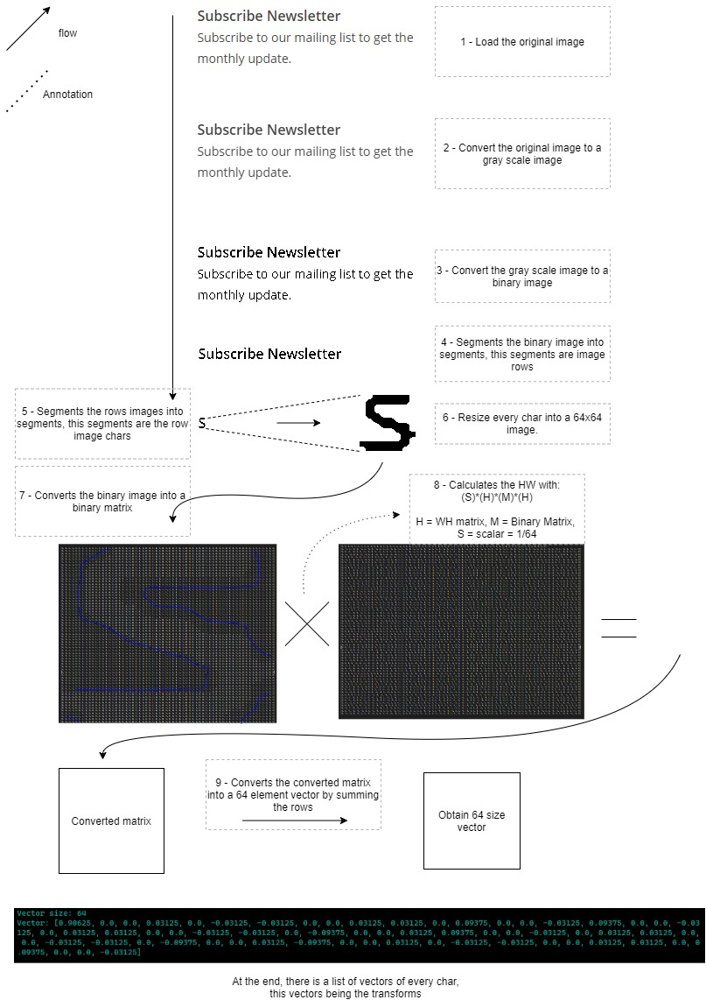

# Python: Custom text image compression

Python: This is an exercise on how to compress text images using custom code to process the image and compress it using the walsh hadamard function.

# Contents
1. [Run](#run)
2. [Problem](#problem)
3. [Rules](#rules)
4. [Solution](#solution) 
5. [Challenges](#challenges)
6. [Annotations](#annotations)
7. [Code flow](#code-flow)

    7.1. [Getting row segments](#getting-the-row-segments)
    7.2. [Getting the char segmentes](#getting-the-char-segmentes)
    7.3. [Walsh Hadamard function](#walsh-hadamard-function)

8. [Conclusion](#conclusion)
9. [Additional information](#additional-information)

##### Run

The program is ready to run with

$ - `App.py` | If you have python installed and added to the native System PATH

$ - `../py App.py` | If you need to call the python binarie compiler in order to execute the programm

**NOTE:** The programm can show a partial work done by modifying the variable `haveToWork` in the `App.py` file, at the top of the code.

## Problem

Linked list which contain segments of the text picture
- Segment's starting x and y coords.
- Segment height and width.
- 64x64 binary picture of the character (initially empty).
- 64 int array (result of the Hadamard transform).
- Final character code.

## Rules

The solution must behave like:
1. Open an image file (color) which contain text (using cv2).

2. Convert to grayscale using a custom implementation.

3. Treshold the grayscale to get a binary picture.

4. Segment vertically, finding not empty rows and building the linked list (finding the bounding box of text rows).

5. Running through the list, segmenting horizontally, seeking empty pixel columns, so finding the bounding box of individual chars, inserting them into, "replacing" the row segment.

6. Cuting out empy rows or columns from the characters bounding box.

7. Transforming each character's picture (the bounding box part of the original picture) to a 64x64 binary image, and storing this in the linked list element.

8. Applying Hadamard-Walsh tranformation to each 64x64 picture, storing the result of the transform into the array.

9. The program should finally compare H-W transform value to a pre-built "database" of various characters with various fonts (the English ABC with maybe Ariel, Times New Roman, and something else) (Not done but it work on various fonts).

## Solution

## Challenges

- The program is **Slow**, this depends on the machine proccessing power BUT, overall is slow.

- The program uses sequential modification on images, this is **not optimal**, but due to the goal of the task being a "learning" task, this is acceptable.

- The program is not optimal, the processing of an image can take several minutes depending on the size. For this task a **8 million pixel images was tested and took around 2 minutes** of proccessing.

- Is not using object oriented programming, even knowing this is not hard to change **I DON'T recommend using OOP**, because this paradigm reduces proccessing speed.

- The programm is **not capable to proccess phone pictures**, specially when peper sound is in the image. I tested som clean phone images and seems to work but is not entirely accurate. This might require a more complex solution like a gauss transform.

## Annotations

- Overall the program is working great, *docstring was used.*

- The `App.py` code includes some statements used to show the proff of work.

- I recommend an IDE with intellisense such as vscode to check the code, this is so you can see the documentation with the pop ups and save time navigating through the code.

- Due to the paradigm used, the docstring includes wich functions are being used. E.g. inside `foo()`, `foo1()` and `foo2()` are being used, this is specified in the docstring of `foo()` for a better comprehension.

- The HW transform is done with binary matrix of single value cell, not pixels.

## Code flow

I'm going to try on explain how the code flow works.

##### Getting the row segments

1. sequential horizontal search until a black pixel is found.
2. starting from the pixel founded searchs horizontally until it finds a blank pixel row. This blank row is the bottom part of the row.
3. while the step 2 is happening the program finds the left smalles pixel and the right greater pixel.
4. When step 2 is done, the bounds are saved and the algorithm looks for the next starting pixel row until it reach the end of the image.
5. segment the original image acording to the segments obtained.
6. time is saved by stopping the search at the momment a black pixel apears, this redices time searching.

##### Getting the char segmentes

1. Sequential vertical search until a black pixel is found.
2. Starting from the pixel founded searchs vertical until it finds a blank pixel column. This blank column is the right part of the char.
3. While the step 2 is happening the program finds the top smalles pixel and the bottom greater pixel.
4. When step 2 is done, the bounds are saved and the algorithm looks for the next starting pixel column until it reach the end 
of the image.
5. Segment the original image acording to the segments obtained.
6. Time is saved by stopping the search at the momment a black pixel apears, this reduces time searching.

##### Walsh Hadamard function

1. Creates the binary matrixes with 0 and 1 acording to the binary images.
2. Creates the HW matrix.
3. Being H = HW matrix & M the binary matrix & a option scalar sometimes used as S = 1 / len(H).
4. for each m in M's: M = H * M * H [* scalar].
5. for each m in M's: sumColumns(M).

## Conclusion

- The program resulted in a *modular program*, you can get an HW array of chars from an image by calling the main function and giving it the path to your image, *I recommend using complete paths NOT relative paths*.

- The program is *using full docstring* showing params, returns, and function being usen inside a function.

- The program *succesfully gets chars without blank spaces* or fixel sizes,this is done by a custom code.

- The program *succesfully applies the HW transform to the 64x64 matrixes*, the Hadamard Walsh matrix is being generated inside the code as custom.

- All images convertions and modifications are *made custom pixel by pixel*.

- The program *needs only a single path* to and image and it will get the HW vectors.

- Dependencies between functions are minimal and said functions are modular, *following modularity rules*.

## Additional information

The code is as specified, it can be improve but this means using non custom functions.

I would love to see the program running in a more powered machine.

Made by freelancer -josucano on fiverr.
